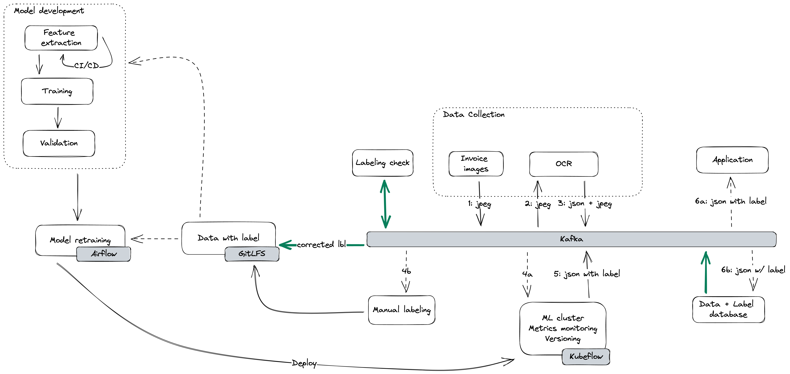

## Architect test

### Prompt

The platform automates the process of invoice creation and payment for customers. The platform will use ML models to predict and extract data from the many different types and layouts of invoices based on past data.

### Suggested architect

